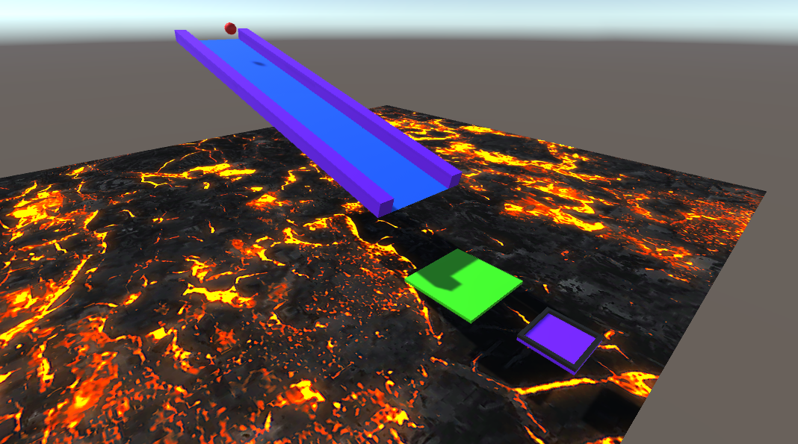

# Essentials 3D project

This is a project I made following Unity Learn's [Essentials of real-time 3D](https://learn.unity.com/project/essentials-of-real-time-3d?uv=2021.3&pathwayId=5f7bcab4edbc2a0023e9c38f&missionId=5f777d9bedbc2a001f6f5ec7) tutorials from the Unity Essentials Pathway.

## *Le levé* micro game

Link to [Unity Play](https://play.unity.com/mg/other/le-leve-s)
